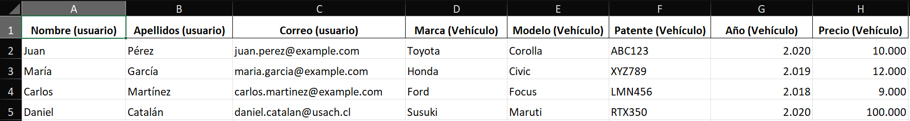

# Prueba Rebits Laravel

Prueba Postulación Ingeniero de Software

# Como instalar

```batch
git clone https://github.com/Danaxar/prueba-rebits-laravel.git
cd prueba-rebits-laravel/app
composer install
npm install
```

Luego, utilizar como referencia el .env.example (cambiar nombre a .env) y asegurarse de rellenar las siguientes variables:

```
DB_CONNECTION=
DB_HOST=127.0.0.1
DB_PORT=
DB_DATABASE=
DB_USERNAME=
DB_PASSWORD=

MAIL_MAILER=smtp
MAIL_HOST=
MAIL_PORT=
MAIL_USERNAME=
MAIL_PASSWORD=
MAIL_ENCRYPTION=tls
EMAIL_TO=support@rebits.cl
```

# Como ejecutar

En `/app` abrir dos terminales y ejecutar

- Terminal 1: `php artisan serve`
- Terminal 2: `npm run dev`

# Documentación

## Base de datos

La base de datos en local fue trabajada con postgresql

### Modelo relacional

En el sistema se cuentan con dos entidades:

- Usuario
- Vehículo.

El vehículo tiene un dueño demarcado por la columna dueño el cual es una llave foránea apuntando al id de la tabla usuario.

Cuando un vehiculo adquiere un nuevo dueño su propiedad dueño es actualizada, sin embargo,
para llevar un registro histórico de las pertenencias entre vehiculos y usuarios. Se crea una
tabla intermedia que almacena el id del usuario y del vehículo junto con la fecha en la que se produce
la obtención del vehiculo.


## Backend

Realizado en php laravel con endpoints siguiendo el estandar REST

### Carga de datos

El sistema permite llenar la base de datos mediante la interfaz en `http://localhost:8000`
con un archivo excel el cual debe tener las siguientes columnas:

- Nombre (usuario)
- Apellidos (usuario)
- Correo (usuario)
- Marca (Vehículo)
- Modelo (Vehículo)
- Patente (Vehículo)
- Año (Vehículo)
- Precio (Vehículo)

Ejemplo, se tiene el siguiente excel el cual se encuentra en `/excelsPruebas/vehiculos_usuarios.xlsx`:



Dicho excel fue utilizado para testear el funcionamiento del algoritmo de carga de datos explicado a continuación.

### Algoritmo

A la hora de cargar datos se debe verificar las siguientes condiciones

- Si el auto ya está registrado, se omite
- Si el auto no está regsitrado
  - Si el usuario existe, guardar el vehiculo con el id del usuario existente
  - Si el usuario no existe, se guarda el usuario y vehiculo


## Frontend

Realizado con Vuejs dentro de laravel. Se comunica con el backend realizando llamados HTTP usando axios. Sin embargo, para cargar las vistas utiliza Inertia utilizando los endpoints de la explicación en `/routes/web.php`


